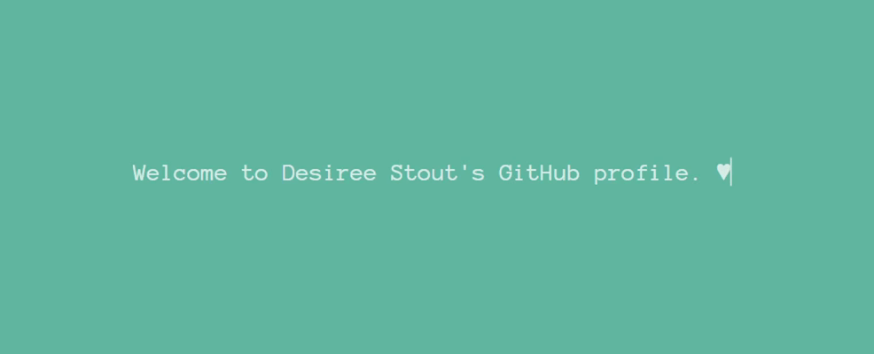

A little about me... 

- Enrolled in full-stack web development bootcamp through James McKelvey School of Engineering at Washington University

- In this program, I'm learning HTML, CSS, JavaScript, jQuery, C#, ASP.net, Python, Django, Java, PHP, Laravel, APIs, Node, terminal commands, DOM manipulation, consuming RESTful, parsing JSON, AJAX and the beauty of debugging...  

- I LOVE how it feels to create with code and I'm looking forward to using my newfound skills to build apps/products/solutions for my clients! 
